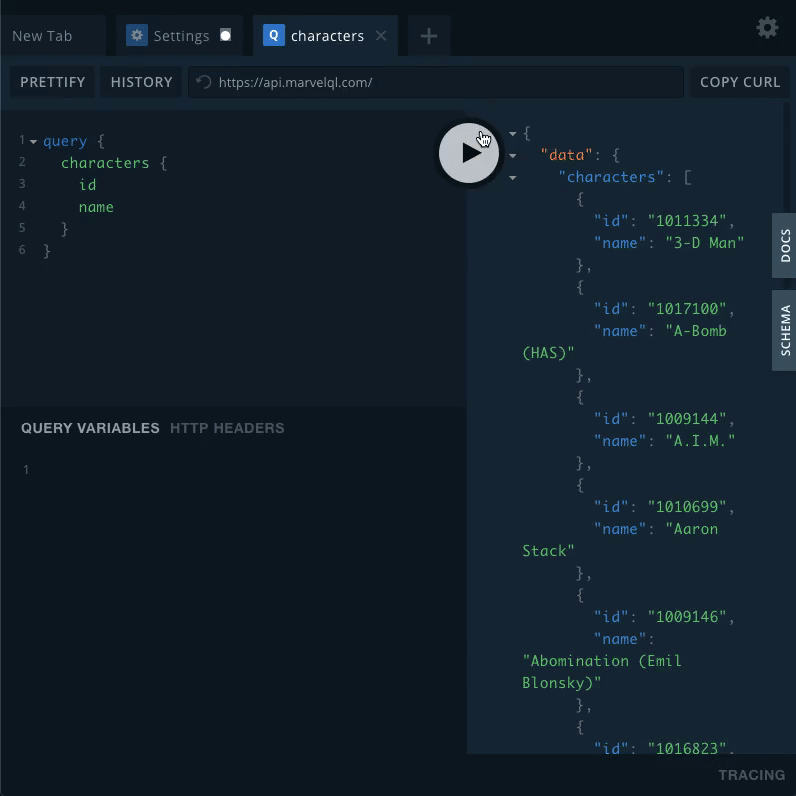

<div align="center">
  </br>
  <h1> MarvelQL </h1> </br>
  An open source GraphQL API that wraps the Marvel REST API</br>
  Try it out now: https://api.marvelql.com/</br></br>
  
</div>

### Description

MarvelQL allows you to send GraphQL queries to Marvel’s REST API to get information about characters, comic series, stories, creators and much more.

### Features

1. Query information from Marvel REST endpoints. Here’s a full list of endpoints that can be queried: https://developer.marvel.com/docs
2. Documentation explaining how to use each endpoint and which arguments can be added to queries
3. Deployment to GraphQL Playground so that you can test queries right away

### Installation

Make sure you are running Node version 8.10.0

Install using yarn

```
yarn
```

Run the server with yarn start

```
yarn start
```

A Playground instance will be opened at http://localhost:4000/ (the port number will be printed to the console) to explore the API.

### Usage

Send a query in GraphQL playground to get a list of characters and information about them.

```
{
  characters {
    id
    name
    description
  }
}
```

Get specific information about one character. Try nesting queries to get more information comics that character is in.

```
{
  getCharacter(where: { name: "Iron Man" }) {
    id
    name
    description
    comics {
      name
    }
  }
}
```

Explore the docs and try out different queries. <br/>

<div align="center"></div>

### Roadmap

We have plans to keep improving MarvelQL. Here's what is next:

1. Improve the speed of queries
2. Implementation with Hasura, Neo4j, and Elm

### Contributing

This is an open source project. To learn how to contribute, please check out our [contributing guide](./CONTRIBUTING.md#contributing-guide).

### License

MIT © [Novvum](https://github.com/novvum)

---

<p align="center">Made with ❤️ by <a href="https://www.novvum.io">Novvum</a></p>
