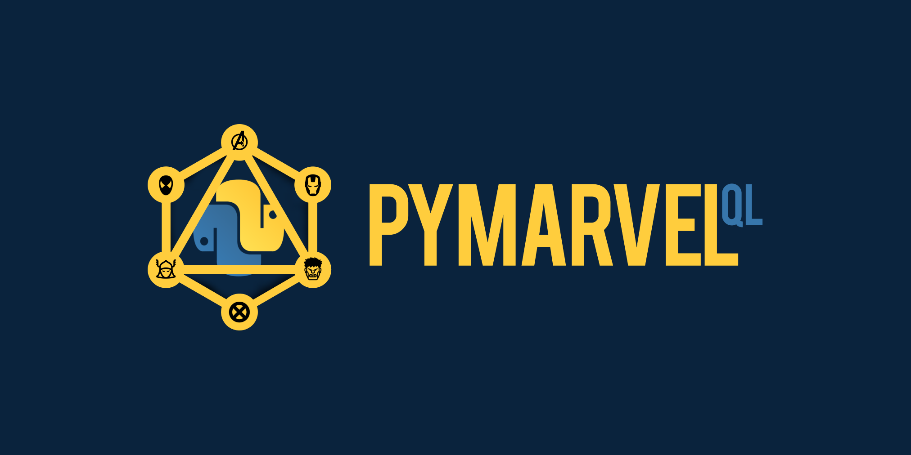

<div align="center">
  
  <h1> PyMarvelQL </h1>
  An open source GraphQL API using Python to wrap the Marvel REST API 
</div>

### Description

PyMarvelQL allows you to send GraphQL queries to Marvel’s REST API to get information about characters, comic series, stories, creators and much more. This project uses Flask and Graphene and it is a Python implemenation of [MarvelQL](https://github.com/Novvum/MarvelQL). Use this project as an example to guide any Python projects that need to query the Marvel API.
<br />
<div align="center">
  
</div>


### Features
* Query information from Marvel REST endpoints. Here’s a full list of endpoints that can be queried: https://developer.marvel.com/docs
* Documentation explaining how to use each endpoint and which arguments can be added to queries
* Deployment to GraphiQL so that you can test queries right away

### Installation

*PyGraphQL requires Python3.*

Install Flask, Graphene, flask-graphene, and marvelous using pip

```
pip install graphene Flask Flask-GraphQL marvelous
```

Run the project using 

```
python3 server.py
```

This will start a flask server at `http://127.0.0.1:5000/`

Visit `http://127.0.0.1:5000/graphql` to query the Marvel API.

### Usage

Send a query to get a list of characters and information about them.

```
{
  characters {
    id
    name
    description
  }
}
```

Get specific information about one character. Try nesting queries to get more information comics that character is in.

```
{
  getCharacter(where: { name: "Iron Man" }) {
    id
    name
    description
    comics {
      name
    }
  }
}
```

Explore the GraphiQL docs and try out different queries. <br/>

### Built With

- [Graphene 2.1](https://graphene-python.org/)
- [Python 3.7](https://www.python.org/)
- [Flask](http://flask.pocoo.org/)
- [flask-graphql](https://github.com/graphql-python/flask-graphql)
- [Marvelous](https://pythonhosted.org/marvelous/)

### Files

There are 4 files that interact with each other.

1. `getData.py` - Retrieves the data from the Marvel API using marvelous
2. `marvelTypes.py` - Has all the types being used for queries
3. `schema.py` - Has the root query that creates the queries and resolvers
4. `server.py` - Has the flask code needed to run the graphql interface to type queries


### Contributing

This is an open source project. To learn how to contribute, please check out our [contributing guide](../../CONTRIBUTING.md#contributing-guide).

### License

MIT © [Novvum](https://github.com/novvum)

---

<p align="center">Made with ❤️ by <a href="https://www.novvum.io">Novvum</a></p>
